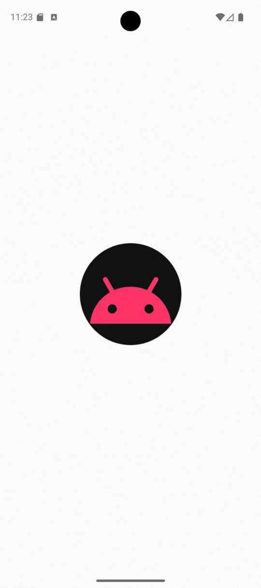

# Navegação entre Telas

  Projeto de demonstração sobre como implementar navegação entre múltiplas telas em um aplicativo Android

<h2>Demonstração</h2>

  

<h1>Funcionalidades</h1>

<table>
  <tr>
    <td align="center">
       
      <b>Tela de Login</b>
    </td>
    <td align="center">
       
      <b>Tela de Menu</b>
    </td>
    <td align="center">
       
      <b>Tela de Perfil</b>
    </td>
    <td align="center">
       
      <b>Tela de Pedidos</b>
    </td>
  </tr>
</table>
